# EXAMEN PRÁCTICO – UNIDAD III - Proyecto en Flutter 
## Desarrollo de Aplicaciones Móviles  
### Automatización de Calidad con GitHub Actions  
**Proyecto:** TeachSpeak – App móvil para aprender inglés técnico para Ingeniería de Sistemas  
**Estudiante:** Camila Fernanda Cabrera Catari  
**Fecha:** 18/11/2025  

---
### 📌 1. URL del Repositorio  
**Repositorio público:**  
👉 https://github.com/ccabrerastu/SM2_Examen_CICD

---
### 📌 2. Descripción del Proyecto: TeachSpeak  
TeachSpeak es una aplicación móvil desarrollada en Flutter cuyo objetivo es ayudar a estudiantes de Ingeniería de Sistemas a mejorar su dominio del inglés técnico mediante módulos interactivos, lecciones, glosarios y evaluaciones básicas.

---

### 📌 3. Estructura del Proyecto  

El repositorio contiene la siguiente estructura relevante para el flujo de trabajo:

```
SM2_ExamenUnidad3/
├── .github/
│   └── workflows/
│       └── ci-pipeline.yml
├── Backend/
├────  test/
│   └── main_test.dart
├── Frontend/
├── README.md
├── image.png
├── image-1.png
├── image-2.png
└── image-4.png
```

---

### Badge de Estado
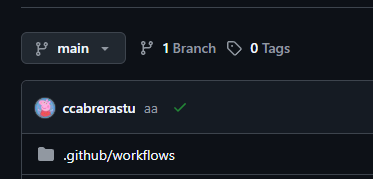

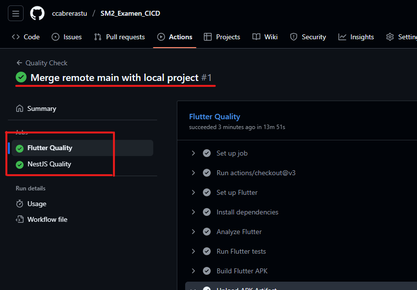
---
### 📌 4. Evidencias 


##### 🖼️ 1. Carpeta .github/workflows/
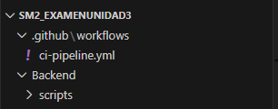
**Descripción:** Muestra que el archivo `quality-check.yml` se encuentra correctamente ubicado.

---

##### 🖼️ 2. Archivo quality-check.yml
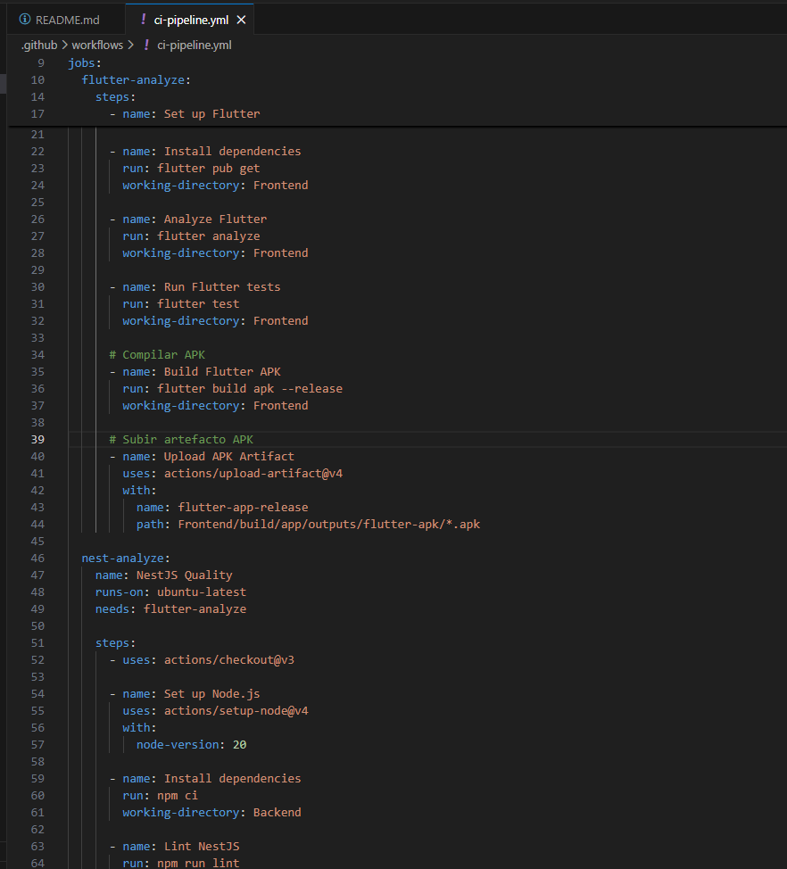
**Descripción:** Contenido del workflow que ejecuta análisis y pruebas.

---

##### 🖼️ 3. Carpeta test/ y archivo main_test.dart

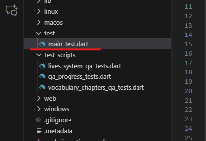

**Descripción:** Evidencia de las 3 pruebas unitarias requeridas.

---
##### 🖼️ 4. Contenido del archivo main_test.dart

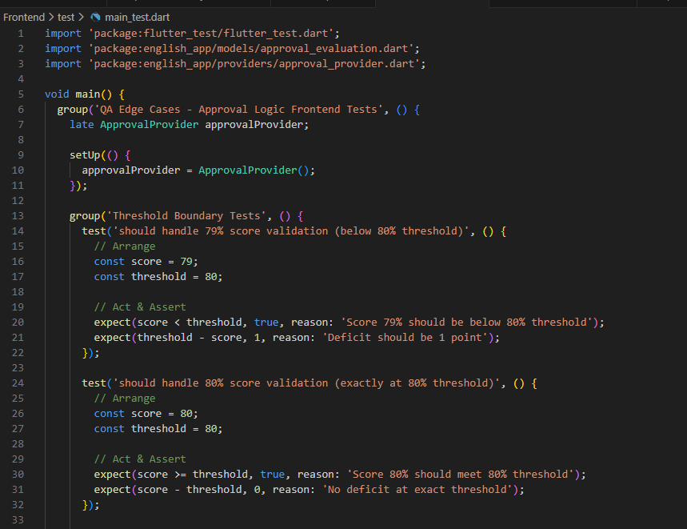
**Descripción:** Dentro del archivo se ejecutan varias pruebas. 

---

##### 🖼️ 5. Ejecución del workflow en GitHub Actions

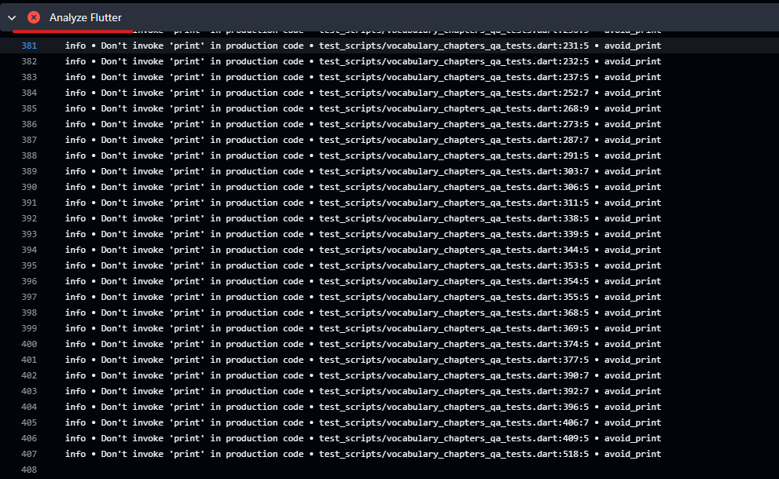
**Descripción:** Demuestras que el pipeline aun no se ejecutó de forma automática por algunos errores del codigo. 

---

##### 🖼️ 6. Ejecución de los tests del frontend

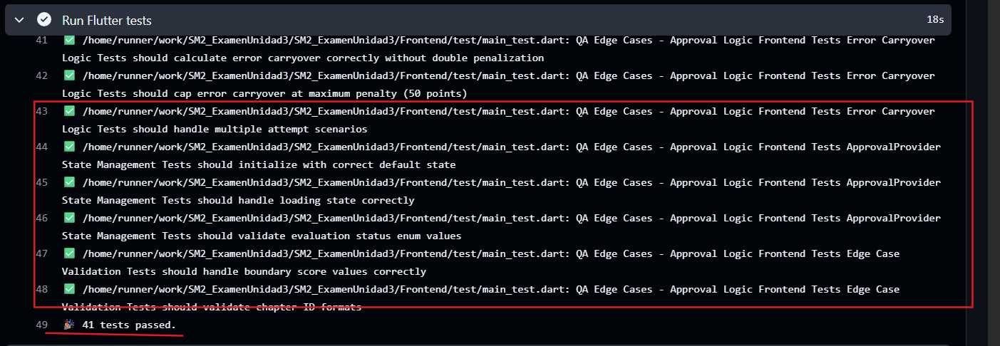

**Descripción:**  Se corrieron exitosamente las pruebas del frontend. Son varios tests que se agregaron en la implementación del código, y hoy implementé adicionales para el examen. 

---

##### 🖼️ 7. Ejecución de los tests del backend


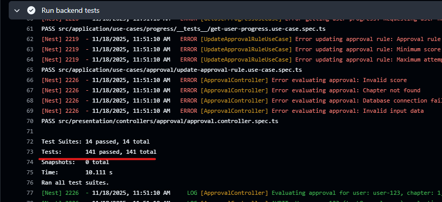

**Descripción:** Se corrieron exitosamente las pruebas del backend con algunos warning pero todo bien.

##### 8. Preparación de la Lógica
###### 📌 Pruebas Unitarias Implementadas

| Nº | Grupo de Prueba                          | Test Implementado                                                                                  | Descripción                                                                                       |
|----|-------------------------------------------|------------------------------------------------------------------------------------------------------|---------------------------------------------------------------------------------------------------|
| 1  | Threshold Boundary Tests                  | 79% por debajo del 80%                                                                              | Verifica que 79 no alcance el threshold mínimo de 80%.                                            |
| 2  | Threshold Boundary Tests                  | 80% cumple el threshold                                                                             | Valida que 80 cumpla exactamente el umbral mínimo.                                                |
| 3  | Threshold Boundary Tests                  | 100% sobre el threshold                                                                             | Asegura que 100 se considere un puntaje superior al umbral.                                       |
| 4  | Critical Chapters 4 & 5                   | Capítulo 4 requiere 100%                                                                            | Verifica que 99 falle y 100 pase (capítulo crítico).                                              |
| 5  | Critical Chapters 4 & 5                   | Capítulo 5 requiere 100%                                                                            | Igual validación estricta que capítulo 4.                                                         |
| 6  | Critical Chapters 4 & 5                   | Identificación de capítulos especiales                                                              | Comprueba que solo capítulos 4 y 5 sean considerados “especiales”.                               |
| 7  | Error Carryover Logic                     | Cálculo básico de penalización                                                                      | Verifica que no exista penalización doble y que nunca sea negativo.                              |
| 8  | Error Carryover Logic                     | Penalización máxima (50 puntos)                                                                     | Comprueba que el castigo no exceda 50 puntos.                                                     |
| 9  | Error Carryover Logic                     | Múltiples intentos                                                                                  | Valida que el segundo intento mantenga penalización del primero.                                 |
|10  | ApprovalProvider State Management         | Estado inicial correcto                                                                              | Revisa valores iniciales del provider.                                                            |
|11  | ApprovalProvider State Management         | Estado de carga                                                                                     | Valida que el estado `loading` se represente correctamente.                                       |
|12  | ApprovalProvider State Management         | Validación de enums                                                                                 | Comprueba valores de `EvaluationStatus`.                                                          |
|13  | Edge Case Validation                      | Valores límite (0–100)                                                                              | Evalúa que todos los puntajes limítrofes caigan en la validación adecuada.                       |
|14  | Edge Case Validation                      | Validación de IDs de capítulos                                                                      | Asegura que solo IDs del 1 al 10 sean válidos.                                                    |


##### 9. Step "APK/ZIP compilado"

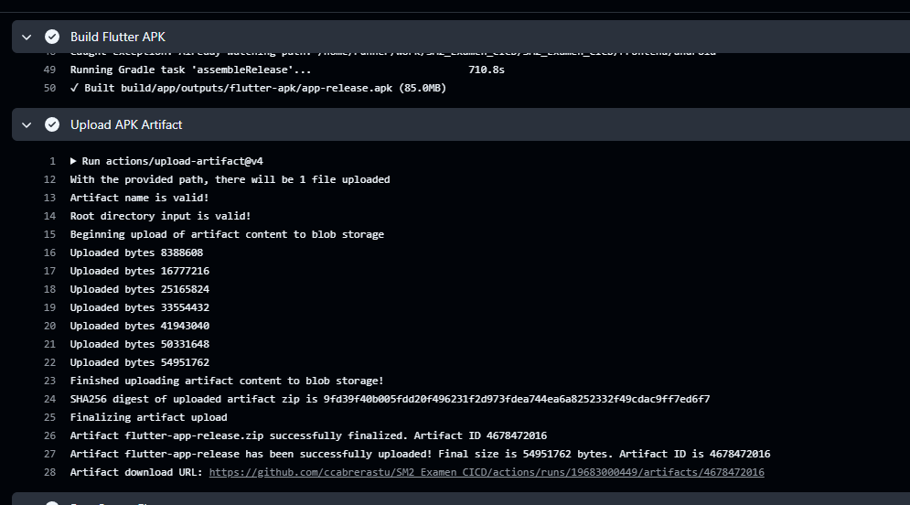

**Descripción:**  Se corrió exitosamente este paso, generandose el APK del proyecto. 

##### 10. Artefacto creado 

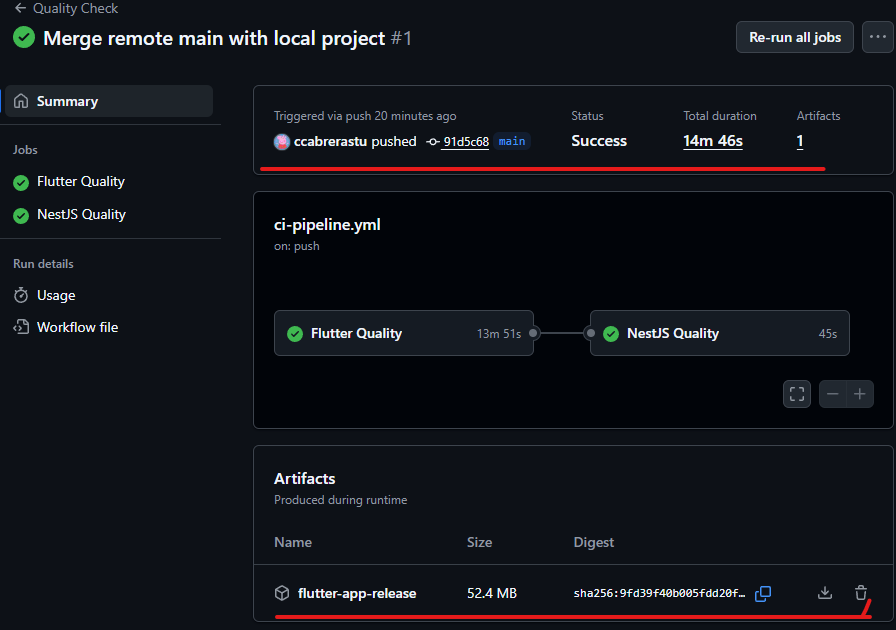

**Descripción:**  Se observa el artefacto creado dentro de la pestaña "actions" del repositorio.

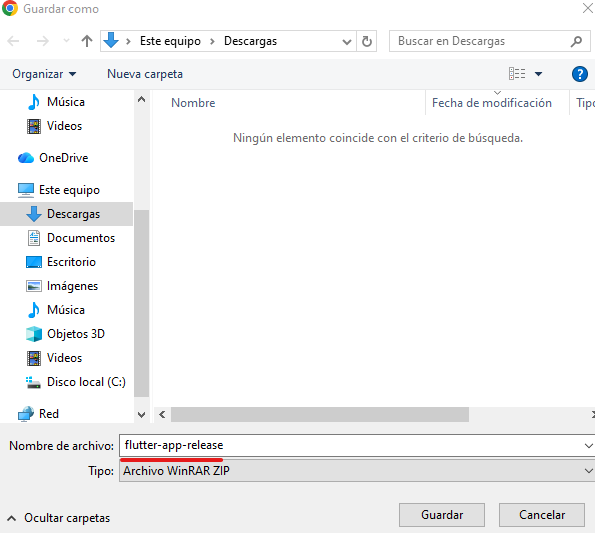

**Descripción:**  Se puede descargar con normalidad

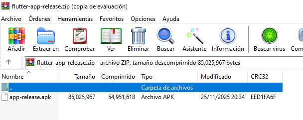

**Descripción:**  Se generó correctamente el APK dentro del ZIP, ya descargado observamos el archivo comprimido y su contenido.

